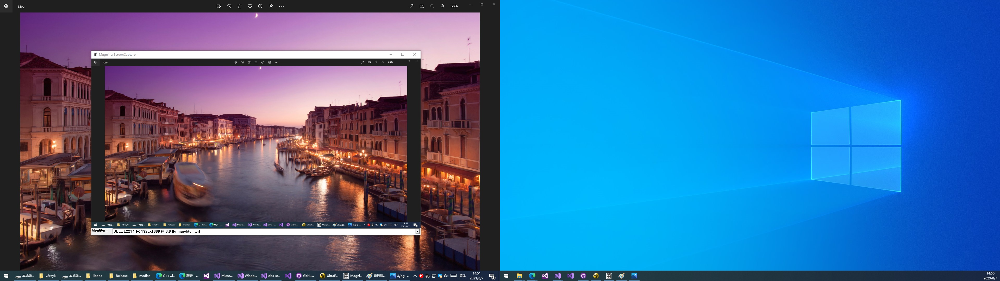
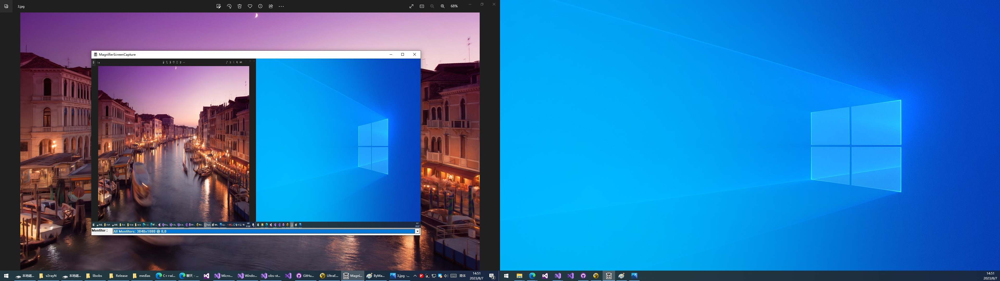
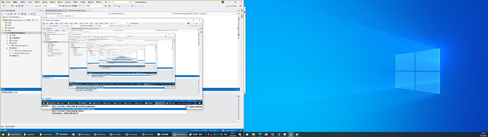
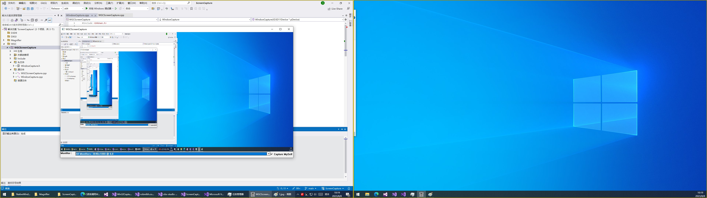
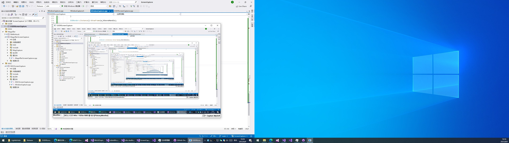
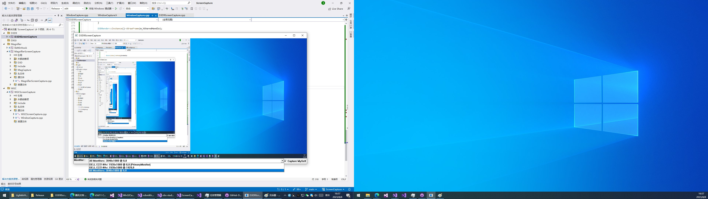

# ScreenCapture

Use WGC, DXGI, Direct3D9, and Magnifier to capture screens. 
You can use them to obtain the D3D texture of the screen for encoding or display.

## MagnifierScreenCapture
MagnifierScreenCapture uses the system's Magnifier interface to capture the screen.
Use libMinHook Hook D3D9Device to render or encode the screen capture d3d9 textture . . .

## WGCScreenCapture

WindowsGraphicsCapture APIs first shipped in the Windows 10 April 2018 Update (1803). These APIs were built for developers who depended on screen capture functionality for their modern applications without depending on restricted capabilities. These APIs enable capture of application windows, displays, and environments in a secure, easy to use way with the use of a system picker UI control.

WGCScreenCapture uses WGC API to capture the screen and render the D3D11 Texture of the screen to the UI.

## D3D9ScreenCapture

D3D9ScreenCapture uses D3D9 API to capture the screen and render the texture of the screen to the UI.

## to be continued. . .
